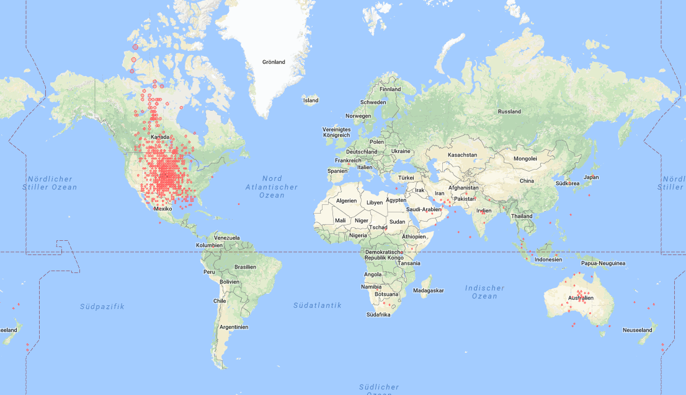

# clickprediction

The aim of this project is to show how a large dataset on website visitors' ad-clicking behaviour may be analyzed.
Information provided by the explored dataset includes 
* the log of users visiting documents: exact date and time, platform (desktop, mobile, tablet), geographical location, traffic source (internal, search, social)
* information regarding the advertisement and context: ad id, document id (URL visited), campaign id and advertiser id

The dataset has been obtained through the Kaggle Competition <a href="https://www.kaggle.com/c/Outbrain-click-prediction">Outbrain Click Prediction</a>; you need an account on kaggle.com to access this data

## Getting Started

In order to execute code provided in this repository, you need Python 3 installed on your machine, and you may need to download the mentioned datasets from Kaggle if you do not possess own similar data.

### First exploration

We will first have a look from which geographical location website visitors were active, because this helps us to have a first glimpse on these users' profiles and possible implications for their ad clicking behaviour.

, user id, document id (the website visited), timestamp (seconds passed since Tuesday, 14. June 2016), ... and geographical location" )
(Data in the events file: a running number; display id (context, i.e. a set of recommendations); user id; document id (the website visited); timestamp (seconds passed since Tuesday, 14. June 2016); ... and geographical location)

It helps to visualize the geographical location of website visitors on a map. For creating the map shown here, random numbers were added to the marker coordinates to scatter markers a little and thus increase expressiveness of this visualization. This method does not really harm accuracy here, as merely the country codes were taken for obtaining geo coordinates anyway.

