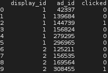

# clickprediction

The ultimate aim of this project is to predict whether website visitors will click on ads shown to them on a page they are currently viewing.
As a first step, the project components provide guidelines on how a large dataset on website visitors' ad-clicking behaviour may be analyzed.
Information provided by the explored dataset includes 
* the log of users visiting documents: exact date and time, platform (desktop, mobile, tablet), geographical location, traffic source (internal, search, social)
* information regarding the advertisement and context: ad id, document id (URL visited), campaign id and advertiser id

The dataset has been obtained through the Kaggle Competition <a href="https://www.kaggle.com/c/Outbrain-click-prediction">Outbrain Click Prediction</a>; you need an account on kaggle.com to access this data.

## Getting Started

In order to execute code provided in this repository, you need Python 3 installed on your machine, and you may need to download the mentioned datasets from Kaggle if you do not possess own similar data.

### First exploration

We will first have a look from which geographical location website visitors were active, because this helps us to have a first glimpse on these users' profiles and possible implications for their ad clicking behaviour.

To **show data from a csv** in your command terminal as shown in the picture below, download the Python file "explore_csv_range.py" to a directory on your machine, then execute the command "python explore_csv_range.py" in a command terminal in the same directory for further usage information.

, user id, document id (the website visited), timestamp (seconds passed since Tuesday, 14. June 2016), ... and geographical location" )

(Data in the events file: a running number; display id (context, i.e. a set of recommendations); user id; document id (the website visited); timestamp (seconds passed since Tuesday, 14. June 2016); ... and geographical location)

It helps to visualize the geographical location of website visitors on a map. For creating the map shown here, random numbers were added to the marker coordinates to scatter markers a little and thus increase expressiveness of this visualization. This method does not really harm accuracy here, as merely the country codes were taken for obtaining geo coordinates anyway. However, it has to be admitted that it would be way more helpful to have data at hand with more exact location information. At least the map shown reveals that most of the users in the dataset were based in the United States.

The map shown below has been created with the Python file "plot_map.py" from this repository; downloading this file to a directory and executing the command "python plot_map.py" in a command terminal in the same directory provides further usage information on how to create such a map with your own data.


### Merging two tables when information in a second table augments that in the first

Sometimes it is useful to write additional information to a table. In our example, we have the tables "events.csv" and "clicks_train.csv", with the following contents:

"events.csv", rows 0 to 10: 


"clicks_train.csv", rows 0 to 10: 



Looking at those two tables, we can see: For every combination of display_id, user_id (uuid) and timestamp (in other words: for every event where a user looked at a website with ads at a certain time) in table "events.csv", table "clicks_train.csv" provides us with information on which ads were shown to him and which ones he clicked. Soon we may want to analyze at which times during the day users are more likely to click on ads, so we first need to create a table that tells us which users were shown which ads and which they clicked on at a certain time.

Looking at our two tables shown above, we see that they have a common element: display_id (the website with ads they were shown at timestamp time). We use this column as a link between the two tables and as a means to combine them. As an example: in the first table, we see that user "cb8c55702adb93" was shown display_id "1" at timestamp "61", and in the second table, we see that display_id "1" brought six ads with it (the first six rows of the mini-table) and the user clicked on ad "144739". Let's create a table that combines this information.

Two follow, download the Python file "csv_from_merged_dfs.py" to a directory on your machine, then execute the command "python csv_from_merged_dfs.py" in a command terminal in the same directory for further usage information. The combined table below was created with the following command:

```
python csv_from_merged_dfs.py csv/events/events.csv csv/clicks_train/clicks_train.csv csv/events_clicks_merged_display_id.csv display_id
```
(For showing the created csv as shown below, see paragraph **show data from a csv** further above)


### Create descriptive statistics to tell at which times of the day users are more likely to click on ads
